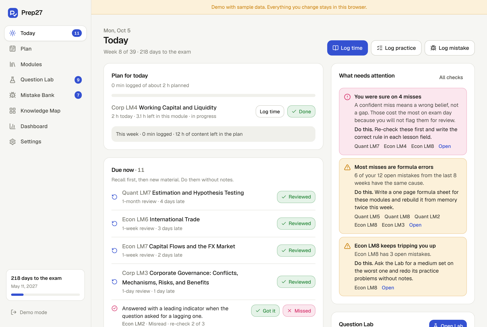
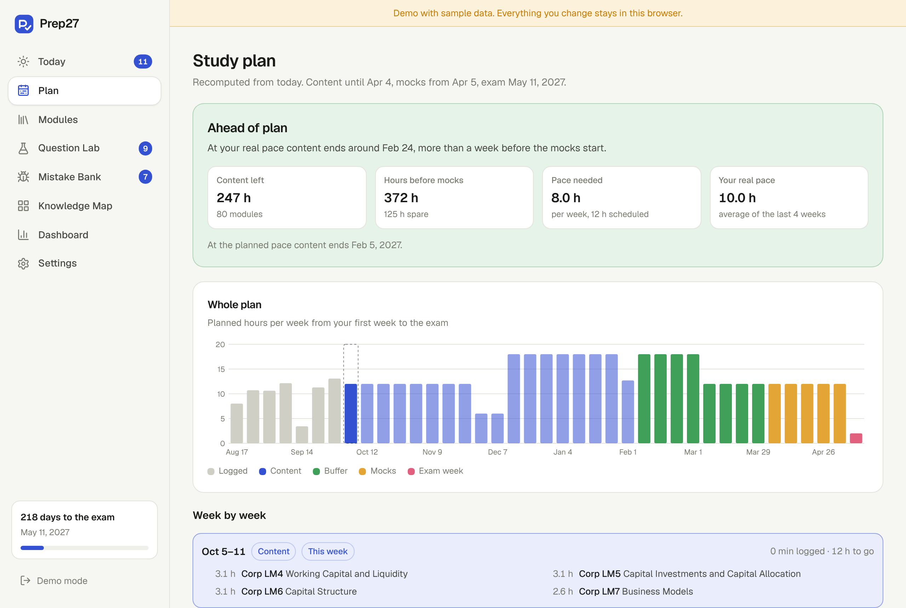
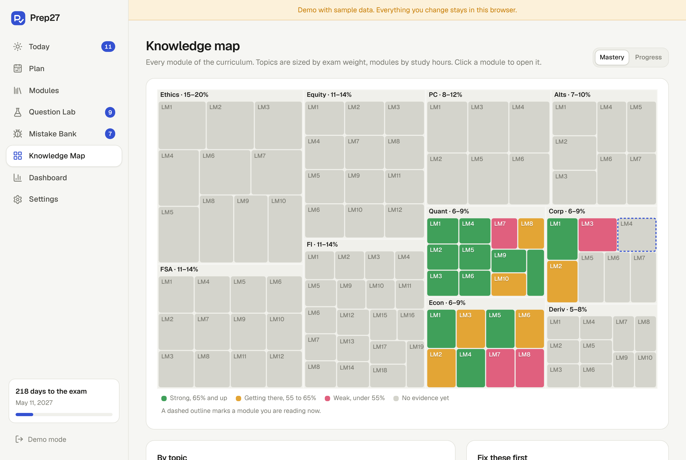
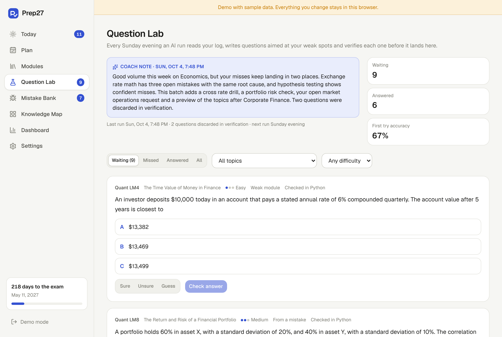
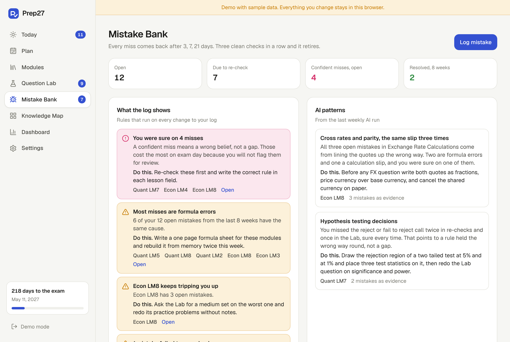
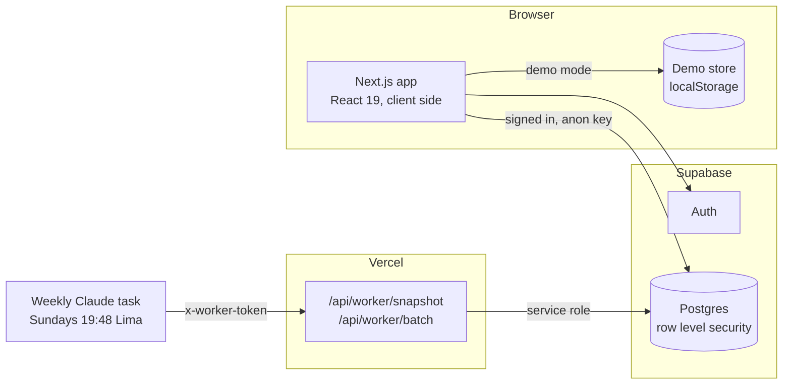

# Prep27

A study system for the May 2027 Level I exam of the CFA Program. It plans the study weeks, keeps every mistake until it stops happening, writes practice questions aimed at weak spots with a weekly AI run, and shows on one map what is actually known.

Built as a personal tool and as a portfolio project. The interesting part is not tracking hours, it is noticing when there is a real problem (a pace that will not finish the content, the same error showing up three times, confident misses, reading without practice) and saying what to do about it.



## What it does

| Module            | What it gives you                                                                                                                                                                                                                                              |
| ----------------- | -------------------------------------------------------------------------------------------------------------------------------------------------------------------------------------------------------------------------------------------------------------- |
| **Today**         | The plan for the day, spaced reviews and mistake re-checks that are due, the latest coach note and the checks that need attention.                                                                                                                             |
| **Adaptive plan** | Recomputed from today on every change. Spreads the unfinished modules over the weeks left before the mock phase, follows dated capacity changes (exams at university, holidays), keeps Sunday for reviews, and compares your real pace with the pace you need. |
| **Question Lab**  | Questions written every week by an AI run, aimed at your requests first, then your mistakes, then your weakest modules. Each one is verified before it lands. Answers, confidence, reports and requests all feed the next run.                                 |
| **Mistake Bank**  | Every miss comes back after 3, 7 and 21 days and retires after three clean checks. Rule based checks and the AI run look for the cause behind the misses.                                                                                                      |
| **Knowledge Map** | All 102 learning modules as a treemap. Topics are sized by exam weight, modules by study hours, colors show mastery or progress.                                                                                                                               |
| **Dashboard**     | Hours per week by activity against the plan, accuracy by week and by topic, readiness replayed week by week, and every check in one place.                                                                                                                     |

There is also a page per module (status, confidence, notes that feed the AI run, reviews, log) and a settings page with the exam date, the hours budget, JSON backups and CSV exports.

| Plan                               | Knowledge map                              |
| ---------------------------------- | ------------------------------------------ |
|  |            |
| **Question Lab**                   | **Mistake Bank**                           |
|    |  |

## How it works



- **One repository interface, two stores.** The UI talks to a `Repo`. In cloud mode it is Supabase under the signed in user, so row level security scopes every query. In demo mode it is a seeded dataset in localStorage. The public demo and the end to end tests both run on the demo store.
- **All study logic is pure TypeScript** in `src/lib` and runs in the browser on every change: mastery, readiness, the planner, spaced repetition and the checks. That keeps the app instant and the logic testable.
- **The AI never touches your data.** The weekly task reads a compact snapshot through a token protected route and posts a batch back. The batch goes through a single SQL function that inserts the batch, its questions and the served requests atomically, and only the service role can call it. Lab answers are graded by a database trigger, not by the client.

### The numbers behind it

- **Mastery** per module = 60% practice accuracy + 20% self rated confidence + 20% spaced reviews done. Accuracy is Laplace smoothed, (correct + 2) / (questions + 4), and recency weighted with a 21 day half life. Below 55% is weak, 65% and up is strong. A module with no evidence has no score instead of a fake one.
- **Readiness** = exam weighted share of the curriculum backed by evidence, Σ weight × mastery over study hours, with untouched modules counting as zero.
- **Hours budget** per module = target hours × topic weight midpoint / Σ midpoints / modules in the topic, editable per module.
- **Plan**. Remaining hours (a module in progress loses the time already logged, down to a 25% floor) are packed day by day in topic order into Monday to Saturday capacity until the mock phase, which takes the last full weeks before the exam week. If they do not fit, every day scales up and the plan reports the weekly hours needed. Measured pace is the average of the last four complete weeks.
- **Question verification**. Numeric questions are recomputed in Python from the stem alone and the key must be the only option that matches. Conceptual ones are re-solved blind in a separate pass. Anything that fails is discarded and counted.

## Tech

Next.js 16 (App Router, Turbopack), React 19, TypeScript, Tailwind CSS 4, Supabase (Postgres, Auth, row level security), Zod, hand built SVG charts and a squarified treemap. Tests with Vitest, PGlite and Playwright.

## Tests

```bash
npm test            # unit and SQL tests
npm run test:e2e    # production build, then Playwright in demo mode
npm run typecheck && npm run lint
```

- **Unit** (Vitest). Curriculum integrity, dates, mastery and readiness, spaced repetition, the planner (fit, overload, capacity changes, Sundays, measured pace, mock phase), the treemap geometry, the checks, backups, the demo dataset and the worker routes with an in memory store.
- **SQL** (PGlite, Postgres compiled to WebAssembly). Runs `supabase/schema.sql` with a stub of Supabase's auth schema and checks the seed, constraints, row level security between two users, read only AI tables, the atomic and idempotent worker function, and server side grading.
- **End to end** (Playwright). Login and demo, today's plan, logging time with persistence, answering and reporting Lab questions, logging mistakes, module status, the map, plan reactions, settings, console errors on every page and the mobile tab bar.

## Run it locally

```bash
npm install
npm run dev
```

Without Supabase variables the app runs in demo mode with seven weeks of sample data. Open http://localhost:3000.

## Deploy your own

1. **Supabase.** Create a project. In the SQL editor run `supabase/schema.sql` once. In Authentication, add your user with email and password, then turn off new sign ups. Copy the project URL, the anon (publishable) key and the service role (secret) key.
2. **GitHub and Vercel.** Push this repository, import it in Vercel and set the variables from `.env.example`. Generate `WORKER_TOKEN` with `openssl rand -hex 32`. `OWNER_USER_ID` is only needed if more than one profile exists.
3. **Weekly AI run.** Create a scheduled Claude task for Sundays at 19:48 Lima time with the prompt in `worker/prompt.md`, replacing `{{BASE_URL}}` with your deployment URL. Put the token in the environment variable `PREP27_WORKER_TOKEN` of the environment the task runs in, never in the prompt or the repository. `worker/example-batch.json` shows a valid batch.

Check the endpoints with `curl -H "x-worker-token: $WORKER_TOKEN" https://your-app.vercel.app/api/worker/snapshot`.

## Project structure

```
src/
  app/                 routes: (app) pages, login, api/worker
  components/          UI, charts, treemap, forms, data provider
    views/             one client view per page
  lib/                 study logic, pure and tested
    repo/              Supabase and demo stores, row mapping, demo data
    worker/            snapshot, batch schema, route handlers
supabase/schema.sql    tables, row level security, worker function, seed
worker/                prompt of the weekly task and an example batch
tests/                 unit, sql and e2e
scripts/gen-seed.ts    regenerates the seed from src/lib/curriculum.ts
```

## Content policy

The repository holds the public topic outline only (topic names, weights and learning module titles). No curriculum text, no official or prep provider questions. The AI run writes original questions from module titles, your own notes and your own mistakes.

## Disclaimer

Prep27 is an independent study tool and is not affiliated with or endorsed by CFA Institute. CFA® and Chartered Financial Analyst® are trademarks owned by CFA Institute.
